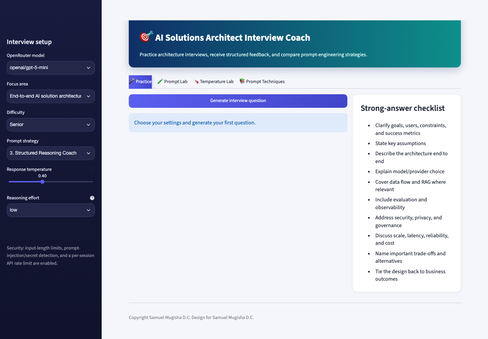
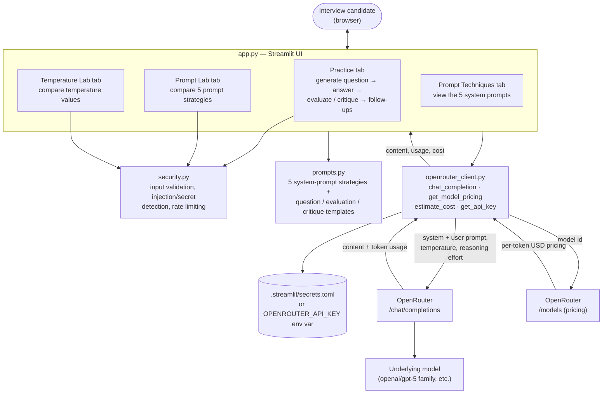

# 🎯 AI Solutions Architect Interview Coach

A Streamlit app for practicing AI Solutions Architect interviews using OpenRouter.


[](https://oyster-app-8ef5k.ondigitalocean.app/)

**🔗 Live app:** [oyster-app-8ef5k.ondigitalocean.app](https://oyster-app-8ef5k.ondigitalocean.app/)



## 📑 Contents

- [✨ What the app includes](#-what-the-app-includes)
- [🏗️ Architecture](#️-architecture)
- [🔑 1. Create your OpenRouter API key](#-1-create-your-openrouter-api-key)
- [📦 2. Install](#-2-install)
- [▶️ 3. Run](#️-3-run)
- [🧪 4. How to evaluate the five prompts](#-4-how-to-evaluate-the-five-prompts)
- [🌡️ 5. How to tune temperature and reasoning effort](#️-5-how-to-tune-temperature-and-reasoning-effort)
- [🔁 6. Follow-up questions](#-6-follow-up-questions)
- [💲 Cost tracking](#-cost-tracking)
- [🔒 Security design](#-security-design)
- [💭 Notes on Chain-of-Thought](#-notes-on-chain-of-thought)

## ✨ What the app includes

- Streamlit front end with a chat/interview-style workflow, custom-themed UI
  (dark sidebar, gradient header banner, card layout, color-coded score badges).
- OpenRouter integration for chat completions and live model pricing.
- Default model: `openai/gpt-5-mini`.
- Optional model selector for:
  - `openai/gpt-5-mini`
  - `openai/gpt-5-nano`
  - `openai/gpt-5`
- Tunable model settings: response **temperature** and **reasoning effort**
  (low/medium/high), both adjustable from the sidebar and applied to every
  model call.
- Five prompt-engineering strategies:
  1. Zero-shot expert interviewer
  2. Few-shot interviewer
  3. Structured reasoning / Chain-of-Thought-inspired coach
  4. Socratic adaptive interviewer
  5. Rubric + self-critique interviewer
- **Prompt Lab** — runs the same candidate answer through all five prompt
  strategies and highlights the highest-scoring one.
- **Temperature Lab** — runs the same candidate answer through the same
  prompt strategy at several temperature values, so you can see how that
  setting changes the score and wording of the feedback.
- **Follow-up question loop** — after evaluating an answer, if the feedback
  includes a follow-up question, you can answer it and get it evaluated too;
  this repeats until the model signals no more probing is needed (or a
  4-round safety cap is reached).
- **Live cost estimation** — every model call's cost is calculated from
  OpenRouter's real-time per-token pricing and actual token usage, shown per
  call and as a running session total in the sidebar.
- Security guards:
  - prompt-injection detection
  - API-key/private-key leakage detection
  - maximum input length
  - per-session request rate limiting
- API key is read server-side and is never entered into a normal chat field.

## 🏗️ Architecture



- **`app.py`** — Streamlit UI, session state, and the four tabs (Practice,
  Prompt Lab, Temperature Lab, Prompt Techniques). Owns the custom CSS theme
  and all score/cost rendering.
- **`prompts.py`** — the five prompt-engineering system prompts plus the
  question-generation, evaluation, and critique instruction templates.
- **`security.py`** — `validate_user_input` (length limit, prompt-injection
  and secret-leakage pattern checks) and `enforce_rate_limit` (per-session
  sliding-window call cap).
- **`openrouter_client.py`** — thin OpenRouter API client: `chat_completion`
  for chat requests (temperature, max tokens, reasoning effort), plus
  `get_model_pricing` / `estimate_cost` for live cost calculation from
  OpenRouter's public `/models` endpoint.
- **`.streamlit/secrets.toml`** (or the `OPENROUTER_API_KEY` env var) — the
  only place the API key lives; it never passes through the chat UI.

## 🔑 1. Create your OpenRouter API key

Sign in to OpenRouter and create an API key in your OpenRouter account/dashboard.

Do **not** commit the key to Git.

### Recommended: Streamlit secrets

Create this file:

`.streamlit/secrets.toml`

Add:

```toml
OPENROUTER_API_KEY = "your_key_here"
```

Or set an environment variable:

```bash
export OPENROUTER_API_KEY="your_key_here"
```

## 📦 2. Install

```bash
python -m venv .venv
source .venv/bin/activate   # Windows: .venv\Scripts\activate
pip install -r requirements.txt
```

## ▶️ 3. Run

```bash
streamlit run app.py
```

Then open the local URL Streamlit prints, normally `http://localhost:8501`.

## 🧪 4. How to evaluate the five prompts

Use the **Prompt Lab** tab.

1. Enter one interview question.
2. Enter the same candidate answer.
3. Click **Run prompt comparison**.
4. The app sends the identical evaluation task to all five system prompts.
5. Compare the scores and qualitative feedback.
6. Repeat across several interview questions before deciding which prompt is best.

A useful evaluation set should include:
- RAG architecture
- agent/tool-calling design
- security/privacy
- LLM evaluation
- cloud integration
- scaling/cost
- stakeholder discovery

The "best" prompt should be selected based on consistency, usefulness, realism, and
how much the feedback improves your answers—not only the numeric score.

## 🌡️ 5. How to tune temperature and reasoning effort

The sidebar exposes two model settings that apply to every call:

- **Response temperature** (0.0–1.0) — lower values give consistent,
  deterministic questions and feedback; higher values give more varied,
  exploratory phrasing.
- **Reasoning effort** (low/medium/high) — how much internal "thinking" a
  reasoning-capable model (like the gpt-5 family) does before answering.
  Higher effort can improve quality but uses more of the token budget on
  hidden reasoning; if set too high relative to `max_tokens`, the model can
  exhaust its budget on reasoning and return an empty response. Low is the
  safe default.

Use the **Temperature Lab** tab to directly compare outputs: enter one
question and answer, pick several temperature values, and run them all
through the currently selected model/strategy to see the score and wording
change side by side.

## 🔁 6. Follow-up questions

After clicking **Evaluate my answer**, if the feedback includes a follow-up
question, a new card appears where you can answer it. Submitting evaluates
that answer the same way and, if the model produces another follow-up,
repeats — up to 4 rounds — until it responds that no further probing is
needed.

## 💲 Cost tracking

Every model call's cost is estimated from OpenRouter's live per-token
pricing (`GET /api/v1/models`) and the actual `prompt_tokens` /
`completion_tokens` returned by that call. You'll see:
- the cost of each individual call (question generation, evaluation,
  critique, each follow-up round, and each Prompt Lab / Temperature Lab run),
- a running **session cost** total in the sidebar.

Pricing is cached for an hour per model to avoid refetching on every call.

## 🔒 Security design

The app intentionally includes an application-layer security module. It blocks common
attempts to reveal system prompts or credentials, detects likely pasted API/private
keys, limits input size, and rate-limits calls within a Streamlit session.

These are basic guards for an assignment/demo. A production deployment should also use
authentication, server-side quotas, provider spend limits, logging/monitoring, secure
secret storage, dependency scanning, and stronger content-abuse controls.

## 💭 Notes on Chain-of-Thought

The structured-reasoning strategy asks the model to reason internally and return only
a concise final rationale. This demonstrates a reasoning-oriented prompt technique
without requesting or exposing private hidden reasoning traces.


